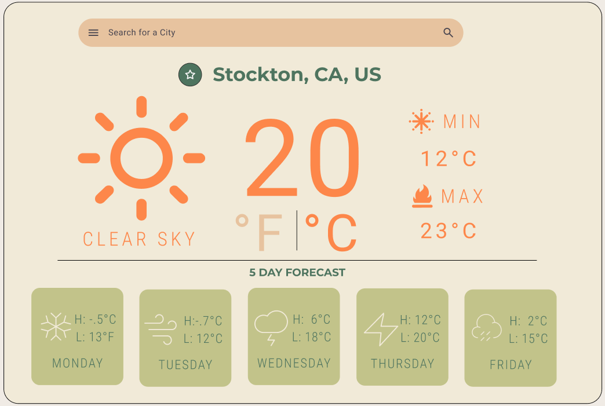

# Weather Sprint

**Description:** Build out a desktop application from the provided figma.

**Developer:** Michael Heckerman

**Date Revised:** 12/13/24

## Links:

[Github-Repo](https://github.com/mkheck13/weathersprint)

[Figma](https://www.figma.com/design/ldUWQTiHsWodPq4GH4jeok/Weather-App?node-id=0-1&t=YdltH3a8wa8KZsqC-1)

[Vercel](https://weathersprint.vercel.app/)

## End Of Day Update

**Day 1**

Completed:
- Working on getting the data to display for the current location. 
- I have gotten the current temp, min and max.
- I also have the description to display along with the current city with the state and country. 

Working On:
- Also need the icon to show. 
- And ability to search. 
- Styling is needed, but only after I can get all the data to display properly.

**Day 2**

Completed:
- Business Redesign presentaion
- Added assets

Working On:
- CSS styling
- getting the needed data from API calls in postman

**Day 3**

Completed:
- Getting all the current days data to show including the icon

Working On:
- Having trouble getting my five day forcast to display, will continue to work on it.

**Day 4**

Working On:
- Still dealing with lots of errors. When I fix one, it breaks other parts of my code. Lots of uncaught errors that are keeping me from having my data display properly. I honestly feel like I have taken a huge step backwards. I am going to take a break for a little bit.

**Day 5**

Completed:
- Have all base items displaying
- Have a basic search function working
- Removed unused code
- Drop down for Favorites

Working On:
- Styles
- saving favorites
- removing favorites

## FeedBack/Peer Review:

**Reviewer**: Charles Orr

**Comments**: I reccomend using "cursor: pointer;" to make your buttons more visible, and possibly on load or on click of the search bar call your fiction to append the local storage, very good job i like the way your site looks and how calm the colors are
